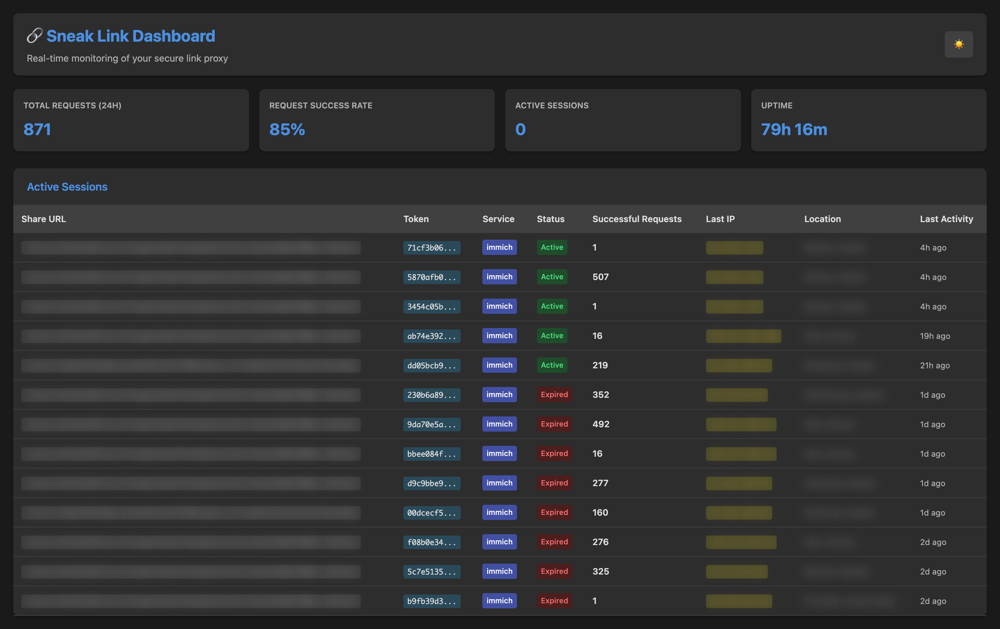

# Sneak Link

A lightweight, open‑source tool for secure link-based access control with **built-in observability and monitoring features**.  
After verifying a URL "knock" on a shared link, Sneak Link issues a cookie that grants access to a protected service. No IP whitelisting required.

**Supports NextCloud, Immich, Paperless-ngx, and Photoprism**, with extensible architecture for additional services.

## Key features

- URL‑knocking trigger to initiate and verify access
- Token stored in cookie for session validation*
- Rate limiting and security event tracking
- No IP whitelisting required

*Paperless serves the document directly on the share URL - no session is granted, direct access restricted to paths with /share/-prefix

### **Built-in observability**
- **Real-time web dashboard** with system metrics and analytics
- **Prometheus metrics endpoint** for monitoring integration
- **Historical data tracking** with SQLite persistence
- **Session analytics** and request logging

### **Easy deployment**
- Minimal dependencies and simple setup
- Docker support with pre-built images
- Extensible architecture for additional services

## Dashboard and metrics

Sneak Link includes a simple monitoring dashboard that provides real-time insights into your system's performance, security events, and user activity.



**Dashboard features:**
- Real-time system metrics
- Active session tracking with geolocation data
- Dark/light mode support for comfortable viewing

**Prometheus integration:**
- Standard Prometheus metrics format at `/metrics` endpoint
- HTTP request metrics (count, duration, status codes)
- Security and rate limiting metrics
- Service-specific validation tracking
- System uptime and performance monitoring
- Ready for Grafana dashboards and alerting

## Usage scenario

You run multiple self-hosted services on your home lab network that you want to access securely from anywhere without exposing them directly to the internet or managing complex VPN setups for occasional users.

### Network setup

**Local network:**
- eg. `nextcloud.yourdomain.com` resolves to internal services via local DNS

**Public internet:**
- eg. `nextcloud.yourdomain.com` resolves to your public IP
- sneak-link responds to web traffic on both domains
- sneak-link is configured to proxy traffic to your private services based on hostname using local DNS

### Access flow

1. **Share creation**: You create share links in your services:
   - NextCloud: `/s/AbCdEf123`
   - Immich: `/share/XyZ789`
   - Paperless-ngx: `/share/secret123`
   - Photoprism: `/s/k2yta5ims0`

2. **URL knocking**: You send the complete URL to someone who needs access:
   - `https://nextcloud.yourdomain.com/s/AbCdEf123`
   - `https://immich.yourdomain.com/share/XyZ789`
   - `https://paperless.yourdomain.com/share/secret123`
   - `https://photoprism.yourdomain.com/s/k2yta5ims0`

3. **Validation**: When they visit the link:
   - sneak-link receives the request and identifies the service by hostname
   - Validates the share exists by checking if your private service returns HTTP status 200
   - If the share doesn't exist (HTTP status 404 or 401), access is denied
   - Rate limiting prevents brute force attempts on share URLs

4. **Access granted**: For valid shares:
   - NextCloud/Immich/Photoprism: sneak-link issues a service-specific cookie for full app access
   - Paperless-ngx: Direct proxy without cookies (single-request access only)
   - User is transparently proxied to your service instance

### Security benefits

- **No IP whitelisting**: External users don't need static IPs or VPN access
- **Valid shares only**: Only existing NextCloud or Immich shares grant access
- **Rate limiting**: Prevents brute force attacks on share URLs
- **Session management**: Cookie-based access with configurable expiration
- **Private network**: NextCloud and Immich remains on private network, not directly exposed

This approach provides secure, link-based access to your NextCloud and Immich instances without exposing your private services directly to the internet.

## Quick start

### Prerequisites
- NextCloud, Immich, Paperless, and/or Photoprism instance running on your private network
- Domain name with split-brain DNS control
- Docker installed

### Running with Docker

1. Generate a secure signing key:
   ```bash
   SIGNING_KEY=$(pwgen -n 32 1)
   ```

2. Run sneak-link using the pre-built image:
   ```bash
   docker run -d \
     --name sneak-link \
     -p 8080:8080 \
     -p 9090:9090 \
     -p 3000:3000 \
     -v sneak-link-data:/data \
     -e NEXTCLOUD_URL=https://nextcloud.yourdomain.com \
     -e IMMICH_URL=https://immich.yourdomain.com \
     -e PAPERLESS_URL=https://paperless.yourdomain.com \
     -e PHOTOPRISM_URL=https://photoprism.yourdomain.com \
     -e SIGNING_KEY=$SIGNING_KEY \
     ghcr.io/felixandersen/sneak-link:latest
   ```

3. Configure your reverse proxy to forward public HTTPS traffic to port 8080

**Note**: sneak-link runs the proxy service on HTTP internally (port 8080). A reverse proxy (nginx, Caddy, Traefik, etc.) must handle HTTPS termination and forward HTTP traffic to sneak-link.

That's it!

## Configuration

### Environment variables

| Variable | Required | Default | Description |
|----------|----------|---------|-------------|
| `NEXTCLOUD_URL` | No* | - | NextCloud instance URL |
| `IMMICH_URL` | No* | - | Immich instance URL |
| `PAPERLESS_URL` | No* | - | Paperless-ngx instance URL |
| `PHOTOPRISM_URL` | No* | - | Photoprism instance URL |
| `SIGNING_KEY` | Yes | - | Secret key for signing authentication tokens |
| `LISTEN_PORT` | No | 8080 | Port for the HTTP server |
| `COOKIE_MAX_AGE` | No | 86400 | Cookie expiration time in seconds |
| `RATE_LIMIT_REQUESTS` | No | 10 | Maximum requests per IP per window |
| `RATE_LIMIT_WINDOW` | No | 300 | Rate limiting window in seconds |
| `LOG_LEVEL` | No | info | Log level (debug, info, warn, error) |
| `METRICS_PORT` | No | 9090 | Port for Prometheus metrics endpoint |
| `DASHBOARD_PORT` | No | 3000 | Port for web dashboard |
| `DB_PATH` | No | /data/sneak-link.db | SQLite database path for metrics storage |
| `METRICS_RETENTION_DAYS` | No | 30 | Data retention period in days |

*At least one service URL must be configured

### Observability endpoints

- **Dashboard**: `http://your-host:3000/` - Web interface for monitoring and analytics
- **Metrics**: `http://your-host:9090/metrics` - Prometheus-compatible metrics endpoint
- **Health Check**: `http://your-host:9090/health` - Service health status

The SQLite database stores historical data at the configured `DB_PATH` and can be mounted as a volume in Docker for persistence.

## Security considerations

⚠️ **Use at your own discretion. This is new software and has not been widely used in production yet.**

- **Share URL Security**: Relies on NextCloud and Immich generating cryptographically secure random share URLs. Weak entropy in NextCloud or Immich compromises the security model.
- **Rate Limiting**: IP-based rate limiting can be bypassed with distributed attacks. Consider additional protection at the reverse proxy level.
- **Session Management**: Cookies persist until expiration even if the original NextCloud or Immich share is deleted. No automatic session invalidation.
- **Cookie Compliance**: Uses cookies for authentication. Consider privacy laws (GDPR, etc.) if deploying for business use or public access.
- **Logging Privacy**: Access logs contain IP addresses and usage patterns. Implement appropriate log retention and privacy policies.

## Logging

sneak-link outputs structured JSON logs with the following event types:

- **access**: HTTP request logs with IP, method, path, status, duration
- **security**: Security events like rate limiting, invalid tokens, unauthorized access
- **validation**: Share validation attempts with results

Example log output:
```json
{"level":"info","msg":"HTTP request","time":"2024-01-01T12:00:00Z","type":"access","ip":"1.2.3.4","method":"GET","path":"/s/AbCdEf123","status":200,"duration":45}
{"level":"warn","msg":"Security event","time":"2024-01-01T12:00:01Z","type":"security","event":"rate_limit_exceeded","ip":"1.2.3.4","details":"requests: 11, window: 5m0s"}
```
